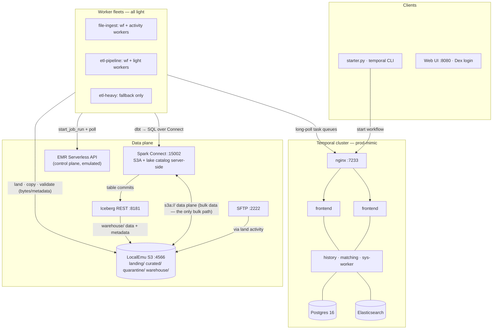
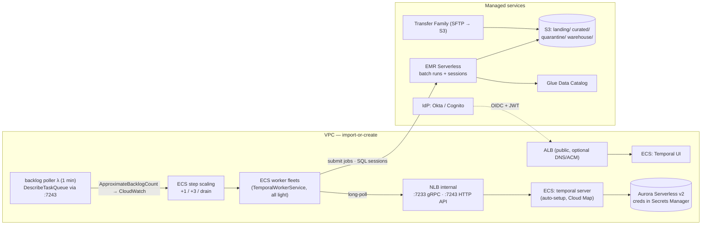

# Architecture — local platform ≙ prod

The design rule throughout: **the local default is the prod shape.** Workers
are light orchestrators; Spark is an external service; the catalog is
configured server-side; data moves cluster ↔ object store and never through
workers. Moving to AWS swaps *bindings* (a URI, a credential source, a
catalog type) — not topology.

## The local system

The one claim to internalize: the **Spark ↔ S3 edge is the only path bulk
data travels** — executors read and write object storage in parallel. Worker
edges carry SQL text, control-plane calls, and single-file streams.

### Ports

| Endpoint | Service |
|---|---|
| `:7233` | Temporal gRPC (nginx → load-balanced frontends) |
| `:8080` | Temporal UI (Dex-protected) |
| `:15002` | Spark Connect server (`sc://localhost:15002`) |
| `:8181` | Iceberg REST catalog |
| `:4566` | LocalEmu (S3, EMR Serverless API, +130 services) |
| `:2222` | SFTP test server (`demo`/`demo`) |
| `:5556` | Dex OIDC |
| `:9090` / `:8085` | Prometheus / Grafana |

## Local ⇄ prod binding map

Each row is one concern. The middle column is the contract that stays fixed;
local and prod are two bindings of it — which is why nothing re-architects
on the way up.

| Concern | Local binding | Invariant contract | Prod binding |
|---|---|---|---|
| File delivery | SFTP container, worker pulls | `landing/` zone in S3 | AWS Transfer Family → S3 event starts the workflow (worker touches no bytes) |
| Object store | LocalEmu `:4566` | `s3://` URIs · `AWS_ENDPOINT_URL` | S3 |
| Temporal cluster | compose prod-mimic | gRPC `:7233` · namespaces | CDK: ECS Fargate + internal NLB + Aurora Serverless v2 |
| Worker fleets | host processes | task-queue names | CDK `TemporalWorkerService`: ECS fleets + backlog autoscaling |
| Interactive Spark | `spark:4.1.1` Connect container | `spark_remote = sc://…` | EMR Serverless session endpoint (pre-initialized capacity) |
| Batch Spark | emulated control plane | `start_job_run` + artifacts in `jobs/` | EMR Serverless job runs (same `spark_job.py` actually executes) |
| Table catalog | Iceberg REST, configured on the Spark server | spec `catalog` / `defaultCatalog` | Glue Data Catalog, enabled on the EMR application |
| Identity (UI) | Dex, static test user | OIDC env vars | Okta / Cognito / Auth0 |
| Credentials | static test keys | SDK default credential chain | IAM task/execution roles + Secrets Manager |
| Visibility | Elasticsearch container | search attributes | managed OpenSearch/Elasticsearch |

## Prod deployment (what the CDK stacks build)

Every CDK dependency is **import-or-create**: pass `-c vpcId=… -c
ecsClusterName=… -c dbEndpoint=… -c hostedZoneId=…` to reuse existing
infrastructure; omit to create it. Architecture knobs: `-c publicUi=false`,
`-c serviceDiscovery=false`, `-c natGateways=0`. The heavy worker queue does
not exist in prod — workers submit, EMR computes.

See [security.md](security.md) for the auth chains and hardening map, and
[etl.md](etl.md) for the pipeline that runs on top of this platform.
