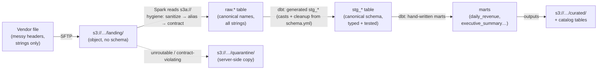
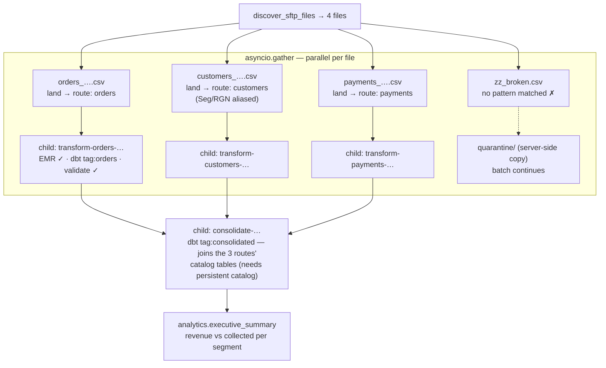

# The ETL — in depth

`etl/` is the full real-world example: a multi-vendor file-ingestion and
transformation platform orchestrated by Temporal. It demonstrates, in one
runnable system: parallel fan-out with child workflows, per-route dispatch
from a spec registry, a canonical data model that *generates* the
normalization, quarantine without batch failure, an Iceberg lakehouse
catalog, three interchangeable Spark execution modes, and worker fleets
following production noisy-neighbor practice.

**Architecture rule #1: workers move bytes, never queries.** Activities may
process data only under the four-test policy in
[workers.md](workers.md#when-may-data-flow-through-a-worker) — byte-shaped,
bounded, streamed, profiled (the SFTP stream and the gunzip preprocess
qualify); all parsing, typing, and transformation happen in Spark + dbt on
the cluster.

**Architecture rule #2: one query engine.** Everything is Spark SQL through
one dbt project — locally against a Spark Connect container, on AWS against
EMR Serverless. No second engine to keep semantically in sync.

## Folder tour

```
etl/
├── run.sh                  # single-transform e2e (worker fleets + starter + asserts)
├── spark_job.py            # THE generic runner: executes any job spec (see below);
│                           #   also the EMR spark-submit entry point
├── activities.py           # DbtSparkJob dataclass + activities:
│                           #   seed_raw_data (demo), submit_emr_job (launcher+poll),
│                           #   run_local_transform (spark_job subprocess/client),
│                           #   validate_output (metadata-first)
├── workflow.py             # EtlPipelineWorkflow: seed? → submit EMR → transform → validate
│                           #   (fleets: repo-root worker_platform, see docs/workers.md)
├── starter.py              # runs the demo job; env-driven catalog/spark mode
├── runtime_env.py          # shared constants (DEFAULT_BUCKET) + env → config helpers
├── tests/                  # unit tests: profiles, spec resolution, runner helpers (CI)
├── requirements.txt        # temporalio · dbt-spark[session] · pyspark[connect] · boto3 · asyncssh
├── dbt/                    # ONE dbt project for every route
│   ├── dbt_project.yml     #   file_format follows catalog mode (parquet ⇄ iceberg)
│   ├── profiles.yml        #   spark `session` method (honors SPARK_REMOTE)
│   ├── macros/build_staging.sql        # generates staging SQL from the canonical model
│   └── models/
│       ├── sources.yml                 # raw.orders / raw.customers / raw.payments
│       ├── staging/schema.yml          # ★ THE CANONICAL DATA MODEL (see below)
│       ├── staging/stg_*.sql           # two-line macro calls — generated normalization
│       └── marts/*.sql                 # hand-written business logic (aggregations, joins)
├── specs/                  # the transform-spec registry
│   ├── registry.json       #   filename pattern → route → spec
│   ├── transform-spec-1..3 #   per-route: source_table, dbt selector, aliases, outputs
│   └── consolidation.json  #   tables-only spec (inputs: []) joining all routes
└── ingest/                 # the file-ingestion pipeline
    ├── run.sh              #   the complex-batch e2e (seeds 4 vendor files over SFTP)
    ├── workflow.py         #   FileIngestWorkflow: parallel fan-out + consolidation
    ├── activities.py       #   discover/land/classify/quarantine/resolve (bytes+metadata only)
    └── schedule.py         #   Temporal Schedule: hourly batch (create/trigger/pause)
```

## The data journey



Files exist on the left, tables in the middle, both on the right. A file that
never conforms never becomes a table.

## The job spec — file ↔ table envelope around a tables-only core

`spark_job.py` executes a JSON **job spec**. Specs on disk are templates; the
ingest pipeline binds the runtime file into them at dispatch:

```jsonc
// template: etl/specs/transform-spec-2.json  (the customers route)
{
  "name": "transform-spec-2",
  "dbt_args": ["build", "--select", "tag:customers"],   // this route's models only
  "source_table": "raw.customers",
  "column_aliases": {                                    // per-VENDOR knowledge:
    "customer": ["cust", "customer_name"],               //   name variants → canonical
    "segment":  ["seg", "tier"],
    "region":   ["rgn", "geo"]
  },
  "outputs": [{ "table": "analytics.dim_customers",
                "key": "curated/dim_customers.json", "format": "json" }]
}

// what the child workflow actually receives after resolve_transform_spec:
{
  "inputs": [{
    "source": "s3://etl-data/landing/customers_2026-08.csv",  // bound at runtime
    "table":  "raw.customers",                                 // the file→table promise
    "format": "csv",
    "hygiene": {
      "sanitize_headers": true,
      "column_aliases":  { …from the spec… },
      "require_columns": [ …derived from schema.yml… ]         // the landing gate
    }
  }],
  "catalog":      { "type": "rest", "uri": "http://localhost:8181", … },  // or "glue"
  "spark_remote": "sc://localhost:15002",                                  // or EMR session
  "outputs": [ … ]
}
```

- **`inputs`** — each entry declares "this object becomes that table," with
  hygiene applied cluster-side. A list: one job can land many files.
- **the dbt core** — operates purely on tables; never sees a file or path.
  The consolidation spec proves it: `"inputs": []`, it reads three tables
  other jobs left in the catalog.
- **`outputs`** — selected tables re-materialize as objects (`json` for
  small assertable marts — capped at 100k rows; `parquet` prefix, written
  distributed by the cluster, for anything big). Tables additionally persist
  in the catalog for SQL consumers.

## The canonical data model — `dbt/models/staging/schema.yml`

One entity per route (grain, columns, types, cleanup, tests). This file
**drives** the normalization; it is not documentation-after-the-fact:

| Derived from schema.yml | Mechanism |
|---|---|
| The staging SQL itself | `build_staging` macro: `data_type` → `cast(…)`, `meta.expr` → cleanup expression (`lower(trim(status))`), else passthrough |
| The ingest landing gate | `resolve_transform_spec` reads the model's column names as `require_columns` |
| Value enforcement | `data_tests` (`not_null`, `unique`, `accepted_values`) run in every `dbt build`; a violation fails the transform child → the file quarantines |

The spec's `column_aliases` is the only per-vendor layer, mapping name
variants *onto* the canonical names (mechanical sanitization already collapses
case/punctuation — `ADDRESS`/`Address` need no alias; `adr`/`add` do).

**Change playbook:**

| Change | Touch |
|---|---|
| Vendor renames a field (`addr_line_1` appears) | 1 alias line in that route's spec |
| An entity gains a field | 1 block in `schema.yml` — SQL, gate, and tests follow |
| A new file type / route | 1 spec file + 1 registry line + a `schema.yml` entity (+ mart models as needed) |
| New business metric | hand-written mart model (generation deliberately stops at staging — aggregations are business logic) |

## Execution modes (per job, via config — no code changes)

| Mode | Set by | Compute runs | Use |
|---|---|---|---|
| **Spark Connect** (default) | `spark_remote: sc://…` | external Spark service — local container ⇄ EMR Serverless interactive session | the prod shape: thin workers, warm engine |
| EMR batch | the submit path (always exercised) | EMR Serverless `start_job_run` executes `spark_job.py` on AWS; emulated control-plane locally | scheduled, self-contained batch |
| In-process fallback | `SPARK_CONNECT_URI=""` | inside the worker subprocess, on the isolated `etl-heavy` queue | offline dev; template for activity-*is*-the-compute workloads |

Catalog is orthogonal: omit for an ephemeral run-scoped catalog, or
`ICEBERG_REST_URI=…` locally / `{"type": "glue"}` on AWS for persistent
Iceberg tables (defined **server-side** on the Spark service, exactly like
Glue is enabled app-level on EMR; specs merely select `defaultCatalog`).

## The ingest pipeline — `FileIngestWorkflow`



Per file: `land` (the one byte-moving activity, heartbeated) → `classify_route`
(filename pattern, zero data read) → `resolve_transform_spec` (registry +
canonical model) → **child `EtlPipelineWorkflow`** with its own workflow ID
(`transform-<route>-<file>`), retries, and search attributes. Failures are
tiered: unroutable files quarantine before any compute; contract violations
fail the child *non-retryably* and quarantine; transient deaths retry
(bounded).

Child workflows give per-file isolation, per-file lineage, independent
retry/reset in the UI, and task-queue routing — the documented production
pattern for per-item pipelines.

## Worker topology (noisy-neighbor practice)

Fleets are instances of the generic **worker platform** (repo-root
`worker_platform/`, see [workers.md](workers.md)): queue + size profile +
registered code, run by `python -m worker_platform`:

| Fleet | Queue | Profile | Registers |
|---|---|---|---|
| ingest coordination | `file-ingest` | small | `FileIngestWorkflow` |
| ingest activities | `file-ingest` | medium | bytes + metadata activities |
| etl coordination | `etl-pipeline` | small | `EtlPipelineWorkflow` |
| etl activities | `etl-pipeline` | medium | launchers, validation, transform *client* |
| big-compute lane | `compute-large` | large | in-process Spark fallback only |

Practices encoded: workflow/activity fleet split, queue segregation,
blocking calls never on an event loop (sync activities on thread pools),
wall-clock heartbeats (never output-driven — quiet Spark stages must not
trigger spurious retries), subprocess terminate-on-cancel (a retry can never
race a zombie attempt), bounded retries with retryable/non-retryable
classification, and log hygiene (raw Spark/dbt output only in worker-local
`job.log`; heartbeats and errors carry counters and controlled aggregates).

## Observability

Every workflow is stamped with custom search attributes; the UI list is a
query engine:

```
WorkflowType = "FileIngestWorkflow"      -- one row per batch
BatchId = "file-ingest-<id>"             -- one batch's entire tree
Route = "payments"                       -- one route across all batches
SourceFile = "orders_2026-08.csv"        -- everything a file spawned
```

On any workflow page: **Relationships** tab = the parent/child tree;
**Timeline** view = the parallel fan-out as overlapping activity lanes.

## Running it

```sh
# dependencies (auto-started by the run scripts where possible)
localemu start                     # S3 + EMR API :4566
nix run .#catalog-up               # Iceberg REST :8181 (for catalog/consolidation runs)
                                   # spark-connect + sftp auto-start

./etl/run.sh                                          # single transform (prod-shaped)
ICEBERG_REST_URI=http://localhost:8181 ./etl/run.sh   # + persistent Iceberg tables
ICEBERG_REST_URI=http://localhost:8181 \
  ./etl/ingest/run.sh                                 # the complex batch + consolidation
SPARK_CONNECT_URI="" ./etl/run.sh                     # in-process fallback
TEMPORAL_NAMESPACE=team-data ./etl/ingest/run.sh      # in the data team's namespace

# scheduled operation (fleets must be deployed/running):
python -m ingest.schedule create      # hourly, created paused, overlap=skip
python -m ingest.schedule unpause     # go continuous
python -m ingest.schedule trigger     # fire one batch now
```

Environment contract: `TEMPORAL_ADDRESS` · `TEMPORAL_NAMESPACE` ·
`SPARK_CONNECT_URI` · `ICEBERG_REST_URI` · `AWS_ENDPOINT_URL` (+ standard
AWS credential variables). Unset `AWS_ENDPOINT_URL` and point the other
knobs at real endpoints, and the same code runs on AWS — the remaining
deltas are credentials-shaped (IAM, Glue, Transfer Family), covered in
[architecture.md](architecture.md) and [security.md](security.md).
