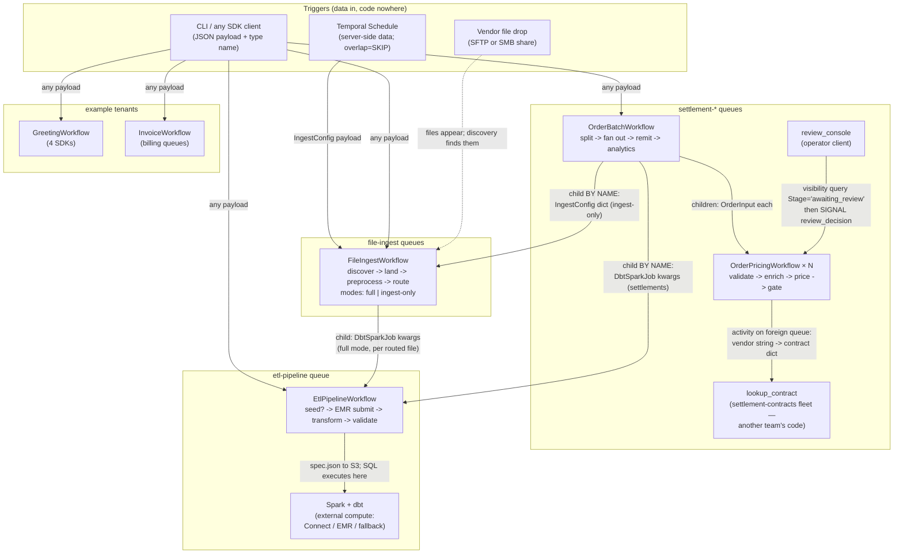

# How the flows compose — the system map

Every workflow in this repo, every way they trigger each other, and the
rules that make the composition safe. Read this to answer "what talks to
what, and what exactly crosses the boundary?"

## The map

## The edges, precisely

| From → To | Mechanism | What crosses | Contract |
|---|---|---|---|
| Schedule → FileIngestWorkflow | server-side Schedule fires the action | `IngestConfig` JSON | `etl/ingest/schedule.py`; cadence changes are API calls |
| Anything → any workflow | `start_workflow` / CLI | payload + workflow-type **string** | the server stores data + names, never code |
| FileIngestWorkflow → EtlPipelineWorkflow | `execute_child_workflow` (full mode, per routed file) | `DbtSparkJob` kwargs built by `resolve_transform_spec` (spec + canonical model + landed key) | child id `transform-<route>-<file>` = idempotency key |
| OrderBatchWorkflow → FileIngestWorkflow | child **by name**, `dispatch_transforms=False` | `IngestConfig`-shaped dict | ingest-only result: `file → route → landed_key` |
| OrderBatchWorkflow → OrderPricingWorkflow | children, `asyncio.gather` | `OrderInput` (policy baked into payload) | id `order-<vendor>-<ref>-<batch-suffix>`; within-batch dupes collide deterministically |
| OrderPricingWorkflow → contract service | `execute_activity` on **another queue** | vendor string → contract dict | the queue is the interface; owner deploys independently |
| review console → OrderPricingWorkflow | visibility query + **signal** | `("approve"/"deny", note)` | the work queue IS the query `Stage='awaiting_review'` |
| OrderBatchWorkflow → EtlPipelineWorkflow | child **by name** | `DbtSparkJob` kwargs (settlements spec, remittance CSV as input) | same generic pipeline the ingest routes use |
| EtlPipelineWorkflow → Spark/dbt | activity uploads spec + polls | spec.json, S3 URIs | compute never runs in workers (four-test policy) |
| EtlPipelineWorkflow → demo seed | activity **by name** (`"seed_raw_data"`) | job payload | only demo-serving fleets register it |

## The composition rules (why this stays safe)

1. **Data + type names travel; code never does.** Every edge above moves a
   JSON payload and a string. The code behind a name lives in whatever
   fleet polls the target queue — so teams deploy independently and the
   server needs no redeploy for any of it.
2. **A queue crossing is a fleet handoff.** `task_queue=` on a child or
   activity is the routing decision; profiles size the fleet
   (docs/workers.md). Congestion on one queue cannot stall another.
3. **Child/workflow ids are idempotency keys.** Deterministic ids make
   duplicates collide instead of double-executing; the collision is caught
   and recorded (`duplicate` status), never fatal.
4. **Search attributes are the lineage plane.** `BatchId` ties a tree
   together, `Route`/`SourceFile`/`OrderId` address records, `Stage` is
   live pipeline state. One vocabulary across ingest, settlement, and
   analytics — registered once (run scripts + the prod namespace-setup
   one-shot).
5. **Failure semantics are tiered everywhere the same way** (decisions
   D5/D7): deterministic failures are non-retryable and quarantine or deny
   *visibly*; transient failures retry bounded; one bad record never fails
   a batch.
6. **Payloads stay small.** Files move S3→S3 or stream through bounded,
   profiled activities; workflows carry pointers and small records
   (split caps exist because records transit history).

## Which flow to copy for a new use case

| You are building… | Copy |
|---|---|
| batch file → per-file transform | ingest route: spec + registry line (+ schema.yml entity) |
| any dbt/Spark job on a trigger | `EtlPipelineWorkflow` payload (CLI/Schedule/code — docs/etl.md "trigger cycle") |
| land files, someone else processes | ingest-only mode (`dispatch_transforms=False`) |
| per-record lifecycle with approvals/SLAs | `examples/order-settlement/` (signals, gates, Stage upserts) |
| a service other teams call from workflows | `contracts.py` (activity on your own queue) |
| an operator surface over in-flight work | `review_console.py` (visibility query + signal) |
| a new team/domain from scratch | `examples/platform-demo/` (image + queues + fleets recipe) |
