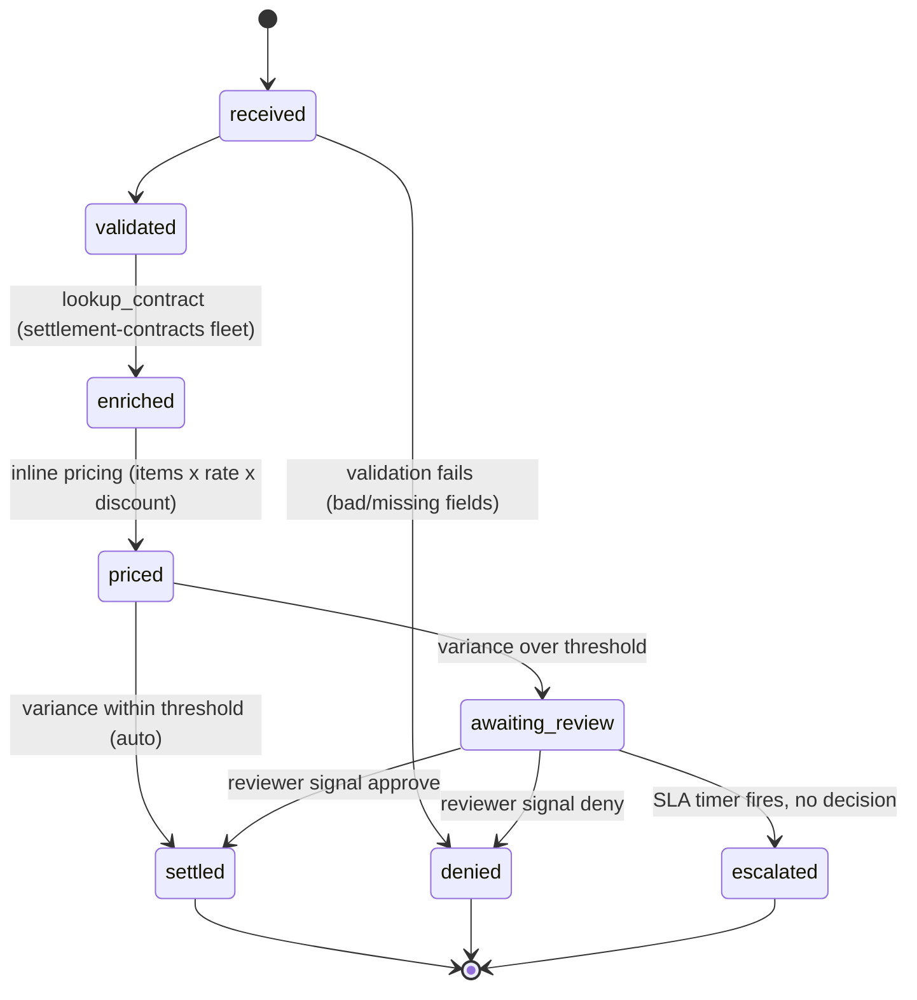

# Order pricing & settlement — the lifecycle tenant

`examples/order-settlement/` is the platform's answer to a different kind of
question than the ETL demos. The ETL asks "how do batches of data get
transformed?" This tenant asks: **how does one business record live a
multi-day, multi-team life — and how do you see exactly where it is at any
moment?** Vendors drop order batch files on the file server; every order
then gets its own durable workflow that is validated, priced against
another team's contract service, gated (auto-settle, human review, or SLA
escalation), settled into an outbound remittance file, and finally
summarized by the analytics pipeline. One workflow tree carries the whole
story.

It is also the first tenant to use **signals, queries,
`workflow.wait_condition`, durable timers, and mid-workflow search-attribute
upserts** — the patterns any approval/exception/lifecycle workload needs.

## The lifecycle



Every transition is a `Stage` search-attribute upsert, so the state above
is **live and queryable** — not log archaeology.

Batch stages mirror it one level up: `ingesting → pricing → remitting →
analytics → complete`.

## End-to-end shape

```
vendor batch file ──SFTP──▶ FileIngestWorkflow (child, BY NAME,
                            dispatch_transforms=False: land + route only)
                                   │  landed_key, route="vendor-orders"
                                   ▼
                    OrderBatchWorkflow (queue settlement-intake)
                       │ split_batch (bounded: 8 MiB / 2000 records)
                       ├───────────── one child per order ─────────────┐
                       ▼                                               ▼
        OrderPricingWorkflow (queue settlement-orders)   … × N, in parallel
            validate → lookup_contract (queue settlement-contracts)
            → price → gate (signal / timer) → outcome row
                       │  outcome rows
                       ▼
            write_remittance ──▶ s3://…/remittance/ + vendor /outbound
                       │  remittance CSV key
                       ▼
            EtlPipelineWorkflow (child, BY NAME, queue etl-pipeline)
                dbt tag:settlements → analytics.pricing_summary mart
```

## Lineage and queryability — the point of the demo

Paste into the UI (or `temporal workflow list --query`):

| Question | Query |
|---|---|
| Everything that happened to this batch | `BatchId = 'order-batch-…'` |
| One order's whole journey | `OrderId = 'ORD-1004'` |
| The reviewers' live work queue | `WorkflowType = 'OrderPricingWorkflow' AND ExecutionStatus = 'Running' AND Stage = 'awaiting_review'` |
| Everything stuck anywhere | `Stage = 'awaiting_review'` or `Stage = 'escalated'` |

The review console (`review_console.py list|approve|deny`) is nothing but
the third query plus a signal — the work queue is **visibility itself**,
no table to build, no status service to run. The Relationships tab on the
batch workflow shows the full tree: ingest child, every order, the
analytics child.

## Queues, fleets, teams

| Queue | Code | Profile | Owner story |
|---|---|---|---|
| `settlement-intake` | `pricing:OrderBatchWorkflow` + split/remit/resolve activities | small / medium | the settlement team's coordination + I/O |
| `settlement-orders` | `pricing:OrderPricingWorkflow` | small | per-order lifecycles (pure decision logic) |
| `settlement-contracts` | `contracts:lookup_contract` | medium | **a different team's service** — the queue is the interface; in prod its own image/deploy |
| `file-ingest`, `etl-pipeline` | platform | — | reused unchanged, invoked by workflow-type name |

`Dockerfile` shows the one-image-many-fleets pattern (same recipe as
`platform-demo`).

## The new patterns, and their rules

- **Policy travels in payloads.** Thresholds and SLAs are fields on
  `BatchInput`/`OrderInput`; only `starter.py` reads env. `os.environ` in
  workflow code is a replay hazard: history replayed on a
  differently-configured worker must not diverge.
- **Signal handlers only mutate state; first valid decision wins.**
  Duplicate and late signals are recorded facts and must be harmless.
- **Decide from state, never from which awaitable woke.** After
  `wait_condition(timeout=…)`, the code checks `self._decision` — if the
  signal and the timer land in the same workflow task, the recorded
  decision wins deterministically on first execution and on replay.
- **Queries are read-only snapshots** (`status()` powers the console's
  detail lines).
- **Stage upserts** use the typed API
  (`workflow.upsert_search_attributes([STAGE.value_set(...)])`); all five
  attributes must be registered before anything starts (run.sh does; the
  prod one-shot registers the same set). Never assert on visibility
  immediately after an upsert — the console polls (SQL visibility ≈
  immediate; the prod-mimic stack's Elasticsearch refreshes ~1s).
- **`split_batch` is bounded (8 MiB / 2000 records)** because every record
  transits workflow history as a child input. Rows with bad numeric fields
  are not dropped — they carry `parse_error` and their lifecycle denies
  them *visibly* (lineage for bad data, same philosophy as quarantine).

**Scale path** (documented, not built): for 100k-record batches, children
receive an S3 pointer + record index and fetch their own record in their
first activity; the batch fans out ids only, and `continue_as_new` chunks
the spawn loop. The lifecycle, gates, and lineage stay identical.

## Where Temporal is the right tool — and where it is not

Use it for what this tenant shows:
- **Long-lived, stateful, per-record lifecycles** — a workflow that can
  wait days for a decision at zero runtime cost, survive every crash and
  deploy, and never lose its place.
- **Durable gates and timers** — the SLA is a first-class timer, not a
  cron sweeping a status table.
- **Cross-team handoffs with independent deploys** — child-by-name and
  activity-by-queue mean the pricing team, contract team, ingest team, and
  data team ship on their own schedules; the server stores only names and
  payloads.
- **Operational lineage** — search attributes turn "where is order X?"
  into a query, and the workflow history is a complete, replayable audit
  of every decision.
- **Retry/quarantine orchestration** — bounded retries, deterministic
  failures quarantined, one bad record never failing a batch.

Do **not** put in Temporal:
- **Request-response serving.** The contract lookup is fine as an activity
  because the caller is a durable workflow; a user-facing API waiting on a
  workflow round-trip is not. Synchronous edges stay HTTP/gRPC.
- **Sub-second latency paths or high-QPS fan-out** — workflow state
  transitions cost history writes; that is the price of durability.
- **Bulk data movement or SQL-shaped work.** Rows never transit workflows
  beyond the bounded split; the mart exists precisely to show the handoff
  — Spark + dbt do set-based work, Temporal orchestrates it (four-test
  policy, docs/workers.md).
- **Streaming** — event-at-a-time pipelines belong on a streaming stack;
  Temporal coordinates around them.
- **A system of record for analytics.** History is an audit of execution,
  not a queryable dataset — that is what the remittance file and the lake
  are for (note `batch_id` in the mart joins analytics back to lineage).

## Running it

```sh
ICEBERG_REST_URI=http://localhost:8181 ./examples/order-settlement/run.sh
# -> pending review: 1            (the console's live queue)
# -> approve: ORD-1004
# -> ORDER SETTLEMENT: PASS
# -> OUTBOUND REMITTANCE: PASS
```

Live-demo variant: run `starter.py start` yourself, browse the UI queries
above while ORD-1004 waits, decide it from the console (or let it
escalate), then `starter.py await --id …`. Knobs: `REVIEW_SLA_SECONDS`,
`VARIANCE_THRESHOLD_PCT`, `SLA_ACTION=deny|escalate`.

To extend: new gate = a signal + a `wait_condition`; new stage = one enum
value + upserts; new downstream consumer = another child-by-name (the
analytics child is the template); new decision service = an activity on
that team's queue.
