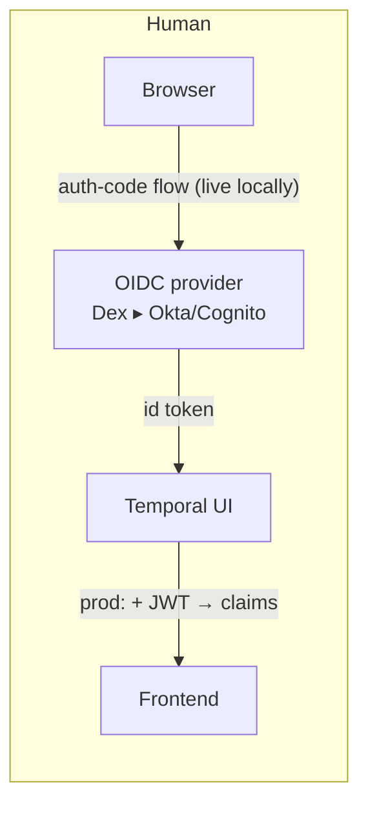
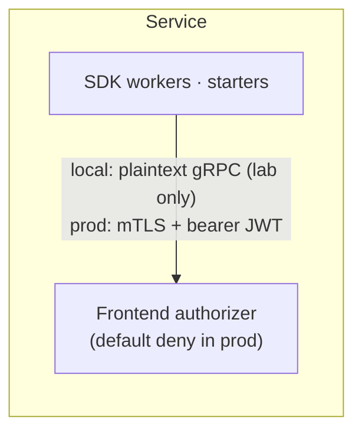
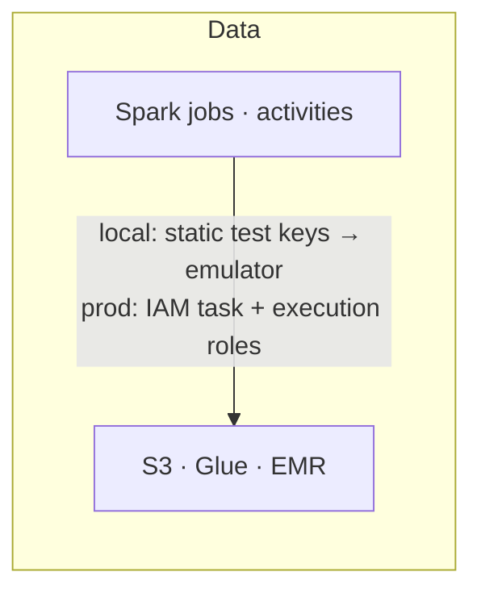

# Security & RBAC

Local runs deliberately soft (it's a laptop). What matters architecturally:
every hardening step is a **binding swap on a seam that already exists** —
not new architecture. One seam is already live end-to-end locally: the UI
will not load without completing a real OIDC login through Dex.

## The three auth chains

In prod, the human chain extends into **per-namespace RBAC**: the JWT claim
mapper turns IdP groups into reader/writer/admin roles per namespace — the
`team-app` / `team-data` namespaces that already exist locally become the
enforcement boundary. Commented config stubs for both the server authorizer
and the UI OIDC are in `docker-compose.prod.yml`.

## Control-by-control

| Control | Local today | Prod target |
|---|---|---|
| Transport | plaintext gRPC/HTTP on localhost | TLS everywhere; mTLS between Temporal services and from SDK clients |
| UI login | Dex OIDC — auth-code flow verified e2e | corporate IdP; same five env vars on the UI task |
| API authorization | none — any client, any namespace | JWT authorizer + claim mapper → per-namespace roles |
| Tenancy | namespaces `team-app` (72h) / `team-data` (168h); isolation verified | same namespaces become RBAC boundaries + per-namespace rate limits |
| Cloud credentials | static test keys → emulator | IAM task roles (workers), EMR execution role (jobs); no long-lived keys |
| DB credentials | compose env | Secrets Manager (already wired in CDK) |
| Payload privacy | history stores payloads in plaintext; small JSON marts returned inline by design | codec server + payload encryption for sensitive namespaces; parquet-only outputs for sensitive marts |
| Log hygiene | raw Spark/dbt output only in worker-local `job.log`; heartbeats/errors carry counters + aggregates; quarantine reasons truncated | same rule + centralized logs with retention |
| Network | host ports on one machine | private subnets, SG-to-SG rules (CDK wires DB/server/UI/worker ingress), internal NLB; only the UI ALB optionally public — `-c publicUi=false` for internal, or `-c uiAllowedCidrs=203.0.113.7/32,198.51.100.0/24` to allowlist office/VPN ranges on a public one (gRPC is never internet-facing) |

## Notes on data leakage paths

- **Search attributes** (`BatchId`, `Route`, `SourceFile`) are indexed and
  visible in list views — keep PII out of them (filenames are the current
  extent).
- **Inline JSON outputs** become part of workflow history (that's what makes
  marts assertable). For sensitive data use `parquet` outputs (S3-only) and,
  in prod, a payload codec.
- **Quarantine reasons** are truncated and stored as S3 object metadata;
  full Spark/dbt logs never leave the worker's local disk.
